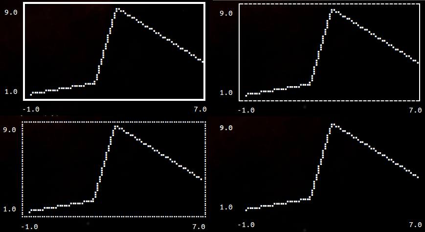
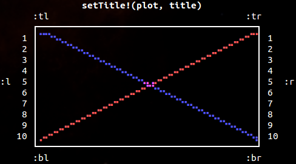

# UnicodePlots

[](LICENSE.md)
[](https://travis-ci.org/Evizero/UnicodePlots.jl)
[](https://coveralls.io/github/Evizero/UnicodePlots.jl?branch=master)

Advanced Unicode plotting library designed for use in Julia's REPL.

## High-level Interface

There are a couple of ways to generate typical plots without much
verbosity. Here is a list of the main high-level functions for
common scenarios:

  - Scatterplot
  - Lineplot
  - Staircase Plot
  - Barplot (horizontal)
  - Histogram (horizontal)
  - Boxplot (horizontal)
  - Sparsity Pattern
  - Density Plot
  - Heatmap

Here is a quick hello world example of a typical use-case:

```Julia
using UnicodePlots
plt = lineplot([-1, 2, 3, 7], [-1, 2, 9, 4], title = "Example Plot", name = "my line", xlabel = "x", ylabel = "y")
```


There are other types of `Canvas` available (see section
"Low-level Interface"). In some situations, such as printing to
a file, using `AsciiCanvas`, `DotCanvas` or `BlockCanvas` might
lead to better results.

```Julia
lineplot([-1, 2, 3, 7], [-1, 2, 9, 4], title = "Example Plot", name = "my line", xlabel = "x", ylabel = "y", canvas = DotCanvas, border = :ascii)
```


Every plot has a mutating variant that ends with a exclamation mark.

```Julia
lineplot!(plt, [0, 4, 8], [10, 1, 10], color = :blue, name = "other line")
```


#### Scatterplot

```Julia
scatterplot(randn(50), randn(50), title = "My Scatterplot")
```


#### Lineplot

```Julia
lineplot([1, 2, 7], [9, -6, 8], title = "My Lineplot")
```


It's also possible to specify a function and a range.

```Julia
plt = lineplot([cos, sin], -π/2, 2π)
```


You can also plot lines by specifying an intercept and slope

```Julia
lineplot!(plt, -0.5, .2, name = "line")
```


#### Staircase plot

```Julia
# supported style are :pre and :post
stairs([1, 2, 4, 7, 8], [1, 3, 4, 2, 7], color = :red, style = :post, title = "My Staircase Plot")
```


#### Barplot

Accepts either two vectors or a dictionary

```Julia
barplot(["Paris", "New York", "Moskau", "Madrid"],
        [2.244, 8.406, 11.92, 3.165],
        title = "Population")
```


_Note_: You can use the keyword argument `symb` to specify the character that should
be used to plot the bars. For example `symb = "#"`

#### Histogram

```Julia
histogram(randn(1000) .* 0.1, nbins = 15, closed = :left)
```


The `histogram` function also supports axis scaling using the
parameter `xscale`.

```Julia
histogram(randn(1000) .* 0.1, nbins = 15, closed = :right, xscale=log10)
```


#### Boxplot

```Julia
boxplot([1,3,3,4,6,10])
```


```Julia
boxplot(["one", "two"], [[1,2,3,4,5], [2,3,4,5,6,7,8,9]], title="Grouped Boxplot", xlabel="x")
```


#### Sparsity Pattern

```Julia
using SparseArrays
spy(sprandn(50, 120, .05))
```


#### Density Plot

```Julia
plt = densityplot(randn(1000), randn(1000))
densityplot!(plt, randn(1000) .+ 2, randn(1000) .+ 2)
```


#### Heatmap Plot

```Julia
heatmap(repeat(collect(0:10)', outer=(11, 1)), zlabel="z")
```


The `heatmap` function also supports axis scaling using the
parameters `xscale`, `yscale` and axis offsets after scaling using `xoffset` and `yoffset`.

The `colormap` parameter may be used to specify a named or custom colormap. See the `heatmap` function documentation for more details.

In addition, the `colorbar` and `colorbar_border` options may be used to enable/disable
the colorbar and configure its border. The `zlabel` option and `zlabel!` method
may be used to set the z axis (colorbar) label.

```Julia
heatmap(collect(0:30) * collect(0:30)', xscale=0.1, yscale=0.1, xoffset=-1.5, colormap=:inferno)
```


### Options

All plots support the set (or a subset) of the following named
parameters.

- `title::String = ""`:

    Text to display on the top of the plot.

- `name::String = ""`:

    Annotation of the current drawing to displayed on the right

- `xlabel::String = ""`:

    Description on the x-axis

- `ylabel::String = ""`:

    Description on the y-axis

- `width::Int = 40`:

    Number of characters per row that should be used for plotting.

    ```Julia
    lineplot(sin, 1:.5:20, width = 80)
    ```
    

- `height::Int = 20`:

    Number of rows that should be used for plotting. Not applicable to `barplot`.

    ```Julia
    lineplot(sin, 1:.5:20, height = 18)
    ```
    

- `xlim::Vector = [0, 1]`:

    Plotting range for the x coordinate

- `ylim::Vector = [0, 1]`:

    Plotting range for the y coordinate

- `margin::Int = 3`:

    Number of empty characters to the left of the whole plot.

- `border::Symbol = :solid`:

    The style of the bounding box of the plot. Supports `:solid`, `:bold`, `:dashed`, `:dotted`, `:ascii`, `:corners`, and `:none`.

  ```Julia
  lineplot([-1.,2, 3, 7], [1.,2, 9, 4], border=:bold)
  lineplot([-1.,2, 3, 7], [1.,2, 9, 4], border=:dashed)
  lineplot([-1.,2, 3, 7], [1.,2, 9, 4], border=:dotted)
  lineplot([-1.,2, 3, 7], [1.,2, 9, 4], border=:none)
  ```
    

- `padding::Int = 1`:

    Space of the left and right of the plot between the labels and the canvas.

- `labels::Bool = true`:

    Can be used to hide the labels by setting `labels=false`.

  ```Julia
  lineplot(sin, 1:.5:20, labels=false)
  ```
    

- `grid::Bool = true`:

    Can be used to hide the gridlines at the origin

- `color::Symbol = :auto`:

    Color of the drawing. Can be any of `:green`, `:blue`, `:red`, `:yellow`, `:cyan`, `:magenta`.

- `canvas::Type = BrailleCanvas`:

    The type of canvas that should be used for drawing (see section "Low-level Interface")

- `symb::AbstractString = "▪"`:

    Barplot only. Specifies the character that should be used to render the bars

_Note_: If you want to print the plot into a file but have monospace issues with your font, you should probably try `border = :ascii` and `canvas = AsciiCanvas` (or `canvas = DotCanvas` for scatterplots).

### Methods

- `title!(plot::Plot, title::String)`

    - `title` the string to write in the top center of the plot window. If the title is empty the whole line of the title will not be drawn

- `xlabel!(plot::Plot, xlabel::String)`

    - `xlabel` the string to display on the bottom of the plot window. If the title is empty the whole line of the label will not be drawn

- `ylabel!(plot::Plot, xlabel::String)`

    - `ylabel` the string to display on the far left of the plot window.

The method `annotate!` is responsible for the setting all the textual decorations of a plot. It has two functions:

- `annotate!(plot::Plot, where::Symbol, value::String)`

    - `where` can be any of: `:tl` (top-left), `:t` (top-center), `:tr` (top-right), `:bl` (bottom-left), `:b` (bottom-center), `:br` (bottom-right), `:l` (left), `:r` (right)

- `annotate!(plot::Plot, where::Symbol, row::Int, value::String)`

    - `where` can be any of: `:l` (left), `:r` (right)

    - `row` can be between 1 and the number of character rows of the canvas



## Low-level Interface

The primary structures that do all the heavy lifting behind the curtain are subtypes of `Canvas`. A canvas is a graphics object for rasterized plotting. Basically it uses Unicode characters to represent pixel.

Here is a simple example:

```Julia
canvas = BrailleCanvas(40, 10, # number of columns and rows (characters)
                       origin_x = 0., origin_y = 0., # position in virtual space
                       width = 1., height = 1.)    # size of the virtual space
lines!(canvas, 0., 0., 1., 1., :blue)     # virtual space
points!(canvas, rand(50), rand(50), :red) # virtual space
lines!(canvas, 0., 1., .5, 0., :yellow)   # virtual space
pixel!(canvas, 5, 8, :red)                # pixel space
```


You can access the height and width of the canvas (in characters) with `nrows(canvas)` and `ncols(canvas)` respectively. You can use those functions in combination with `printrow` to embed the canvas anywhere you wish. For example, `printrow(STDOUT, canvas, 3)` writes the third character row of the canvas to the standard output.

As you can see, one issue that arises when multiple pixel are represented by one character is that it is hard to assign color. That is because each of the "pixel" of a character could belong to a different color group (each character can only have a single color). This package deals with this using a color-blend for the whole group.


At the moment there are the following types of Canvas implemented:

  - **BrailleCanvas**:
    This type of canvas is probably the one with the highest resolution for Unicode plotting. It essentially uses the Unicode characters of the [Braille](https://en.wikipedia.org/wiki/Braille) symbols as pixel. This effectively turns every character into 8 pixels that can individually be manipulated using binary operations.

  - **BlockCanvas**:
    This canvas is also Unicode-based. It has half the resolution of the BrailleCanvas. In contrast to BrailleCanvas, the pixels don't have visible spacing between them. This canvas effectively turns every character into 4 pixels that can individually be manipulated using binary operations.

  - **HeatmapCanvas**:
    This canvas is also Unicode-based. It has half the resolution of the BlockCanvas. This canvas effectively turns every character into 2 color pixels, using the foreground and background terminal colors. As such, the number of rows of the canvas is half the number of y coordinates being displayed.

  - **AsciiCanvas** and **DotCanvas**:
    These two canvas utilizes only standard ASCII character for drawing. Naturally, it doesn't look quite as nice as the Unicode-based ones. However, in some situations it might yield better results. Printing plots to a file is one of those situations.

  - **DensityCanvas**:
    Unlike the BrailleCanvas, the density canvas does not simply mark a "pixel" as set. Instead it increments a counter per character that keeps track of the frequency of pixels drawn in that character. Together with a variable that keeps track of the maximum frequency, the canvas can thus draw the density of datapoints.

  - **BarplotGraphics**:
    This graphics area is special in that it does not support any pixel manipulation. It is essentially the barplot without decorations but the numbers. It does only support one method `addrow!` which allows the user to add additional bars to the graphics object

## Installation

To install UnicodePlots, start up Julia and type the following
code-snipped into the REPL. It makes use of the native Julia
package manger.

```Julia
using Pkg
Pkg.add("UnicodePlots")
```

## License

This code is free to use under the terms of the MIT license.

## Acknowledgement

Inspired by [TextPlots.jl](https://github.com/sunetos/TextPlots.jl), which in turn was inspired by [Drawille](https://github.com/asciimoo/drawille)
