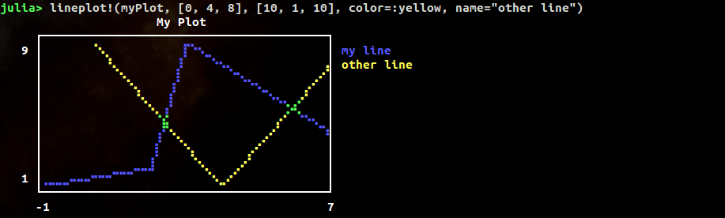
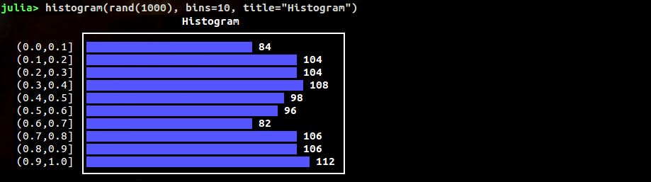
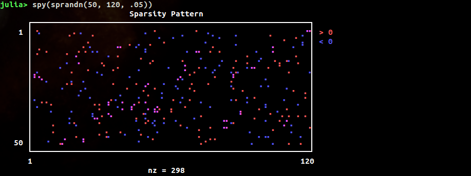
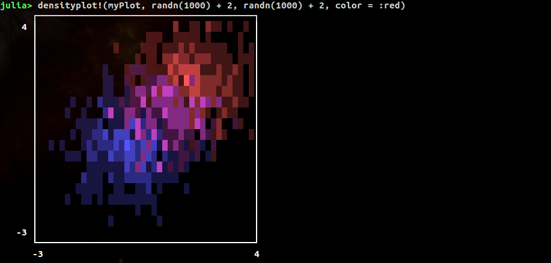

# UnicodePlots

[](LICENSE.md)
[](http://pkg.julialang.org/?pkg=UnicodePlots&ver=0.3)
[](http://pkg.julialang.org/?pkg=UnicodePlots&ver=0.4)

Advanced Unicode plotting library designed for use in Julia's REPL.

## Installation

There are no dependencies on other packages. Developed for Julia v0.3 and v0.4

```Julia
Pkg.add("UnicodePlots")
using UnicodePlots
```

For the latest developer version:

[](https://travis-ci.org/Evizero/UnicodePlots.jl)
[](https://coveralls.io/github/Evizero/UnicodePlots.jl?branch=master)

```Julia
Pkg.checkout("UnicodePlots")
```

## High-level Interface

There are a couple of ways to generate typical plots without much verbosity. Here is a list of the main high-level functions for common scenarios:

  - Scatterplot
  - Lineplot
  - Barplot (horizontal)
  - Staircase Plot
  - Histogram (horizontal)
  - Sparsity Pattern
  - Density Plot

Here is a quick hello world example of a typical use-case:

```Julia
myPlot = lineplot([-1, 2, 3, 7], [1, 2, 9, 4], title="My Plot", name="my line")
```


Every plot has a mutating variant that ends with a exclamation mark.

```Julia
lineplot!(myPlot, [0, 4, 8], [10, 1, 10], color = :yellow, name = "other line")
```



#### Scatterplot

```Julia
scatterplot(randn(50), randn(50), title = "My Scatterplot", color = :red)
```


#### Lineplot

```Julia
lineplot([1, 2, 7], [9, -6, 8], title = "My Lineplot", color = :blue)
```


It's also possible to specify a function and a range.

```Julia
myPlot = lineplot([cos, sin], -π/2, 2π)
```


You can also plot lines by specifying an intercept and slope

```Julia
lineplot!(myPlot, -0.5, .2)
```


#### Barplot

Accepts either two vectors or a dictionary

```Julia
barplot(["Paris", "New York", "Moskau", "Madrid"],
        [2.244, 8.406, 11.92, 3.165],
        title = "Population")
```


#### Staircase plot

```Julia
# supported style are :pre and :post
stairs([1, 2, 4, 7, 8], [1, 3, 4, 2, 7], color = :red, style = :post, title = "My Staircase Plot")
```


#### Histogram

```Julia
histogram(randn(1000), bins=15, title="Histogram")
```


#### Sparsity Pattern

```Julia
spy(sprandn(50, 120, .05))
```


#### Density Plot

```Julia
myPlot = densityplot(randn(1000), randn(1000), color = :blue)
densityplot!(myPlot, randn(1000) + 2, randn(1000) + 2, color = :red)
```


### Options

All plots support a common set of named parameters

- `title::String = ""`:

    Text to display on the top of the plot.

- `name::String = ""`:

    Annotation of the current drawing to displayed on the right

- `width::Int = 40`:

    Number of characters per row that should be used for plotting.

    ```Julia
    lineplot(sin, 1:.5:20, width = 80)
    ```
    

- `height::Int = 10`:

    Number of rows that should be used for plotting. Not applicable to `barplot`.

    ```Julia
    lineplot(sin, 1:.5:20, height = 18)
    ```
    

- `xlim::Vector = [0, 1]`:

    Plotting range for the x coordinate

- `ylim::Vector = [0, 1]`:

    Plotting range for the y coordinate

- `margin::Int = 3`:

    Number of empty characters to the left of the whole plot.

- `border::Symbol = :solid`:

    The style of the bounding box of the plot. Supports `:solid`, `:bold`, `:dashed`, `:dotted`, `:ascii`, and `:none`.

  ```Julia
  lineplot([-1.,2, 3, 7], [1.,2, 9, 4], border=:bold)
  lineplot([-1.,2, 3, 7], [1.,2, 9, 4], border=:dashed)
  lineplot([-1.,2, 3, 7], [1.,2, 9, 4], border=:dotted)
  lineplot([-1.,2, 3, 7], [1.,2, 9, 4], border=:none)
  ```
    

- `padding::Int = 1`:

    Space of the left and right of the plot between the labels and the canvas.

- `labels::Bool = true`:

    Can be used to hide the labels.

  ```Julia
  lineplot(sin, 1:.5:20, labels=false)
  ```
    

- `grid::Bool = true`:

    Can be used to hide the gridlines at the origin

- `color::Symbol = :blue`:

    Color of the drawing. Can be any of `:blue`, `:red`, `:yellow`

- `canvas::Type = BrailleCanvas`:

    The type of canvas that should be used to for drawing (see section "Low-level Interface")

- `symb::AbstractString = "▪"`:

    Barplot only. Specifies the character that should be used to render the bars

_Note_: If you want to print the plot into a file but have monospace issues with your font, you should probably try `border=:dotted`.

### Methods

- `title!(plot::Plot, title::String)`

    - `title` the string to write in the top center of the plot window. If the title is empty the whole line of the title will not be drawn

- `xlabel!(plot::Plot, xlabel::String)`

    - `xlabel` the string to display on the bottom of the plot window. If the title is empty the whole line of the label will not be drawn

- `ylabel!(plot::Plot, xlabel::String)`

    - `ylabel` the string to display on the far left of the plot window.

The method `annotate!` is responsible for the setting all the textual decorations of a plot. It has two functions:

- `annotate!(plot::Plot, where::Symbol, value::String)`

    - `where` can be any of: `:tl` (top-left), `:t` (top-center), `:tr` (top-right), `:bl` (bottom-left), `:b` (bottom-center), `:br` (bottom-right)

- `annotate!(plot::Plot, where::Symbol, row::Int, value::String)`

    - `where` can be any of: `:l` (left), `:r` (right)

    - `row` can be between 1 and the number of character rows of the canvas


## Low-level Interface

The primary structures that do all the heavy lifting behind the curtain are subtypes of `Canvas`. A canvas is a graphics object for rasterized plotting. Basically it uses Unicode characters to represent pixel.

Here is a simple example:

```Julia
canvas = BrailleCanvas(40, 10, # number of columns and rows (characters)
                       plotOriginX = 0., plotOriginY = 0., # position in virtual space
                       plotWidth = 1., plotHeight = 1.) # size of the virtual space
drawLine!(canvas, 0., 0., 1., 1., :blue)    # virtual space
setPoint!(canvas, rand(50), rand(50), :red) # virtual space
drawLine!(canvas, 0., 1., .5, 0., :yellow)  # virtual space
setPixel!(canvas, 5, 8, :red)               # pixel space
```


You can access the height and width of the canvas (in characters) with `nrows(canvas)` and `ncols(canvas)` respectively. You can use those functions in combination with `printrow` to embed the canvas anywhere you wish. For example, `printrow(STDOUT, canvas, 3)` writes the third character row of the canvas to the standard output.

As you can see, one issue that arises when multiple pixel are represented by one character is that it is hard to assign color. That is because each of the "pixel" of a character could belong to a different color group (each character can only have a single color). This package deals with this using a color-blend for the whole group.


At the moment there are few types of Canvas implemented:

  - **BrailleCanvas**:
    This type of canvas is probably the one with the highest resolution for Unicode plotting. It essentially uses the Unicode characters of the [Braille](https://en.wikipedia.org/wiki/Braille) symbols as pixel. This effectively turns every character into 8 pixels that can individually be manipulated using binary operations.

  - **DensityCanvas**:
    Unlike the BrailleCanvas the density canvas does not simple mark a "pixel" as set. Instead it increments a counter per character that keeps track of the frequency of pixels drawn in that character. Together with a variable that keeps track of the maximum frequency, the canvas can thus draw the density of datapoints.

  - **BarplotGraphics**:
    This graphics area is special in that it does not support any pixel manipulation. It is essentially the barplot without decorations but the numbers. It does only support one method `addRow!` which allows the user to add additional bars to the graphics object

## Todo

- [ ] Animated plots using cursor movement
- [ ] 4x4-block-canavs as preparation for histograms
- [ ] Add heatmaps and hinton diagrams
- [ ] Boxplots in some form

## License

This code is free to use under the terms of the MIT license.

## Acknowledgement

Inspired by [TextPlots.jl](https://github.com/sunetos/TextPlots.jl), which in turn was inspired by [Drawille](https://github.com/asciimoo/drawille)
