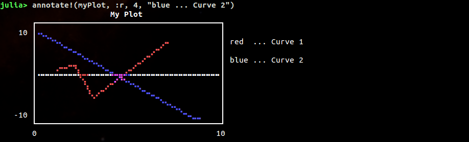

# UnicodePlots

Advanced Unicode plotting library designed for use in Julia's REPL.

[](https://travis-ci.org/Evizero/UnicodePlots.jl)

## Installation

There are no dependencies on other packages. Developed for Julia v0.3 and v0.4

```
Pkg.clone("https://github.com/Evizero/UnicodePlots.jl")
```

## High-level Interface

There are a couple of ways to generate typical plots without a lot of verbosity. There are four main high-level functions to use for typical scenarios:

  - Scatterplot
  - Lineplot
  - Barplot (horizontal)
  - Staircase Plot
  
Here is a quick hello world example of a typical use-case:

```
myPlot = lineplot([1, 2, 3, 7], [1, 2, -1, 4], color=:red, title="My Plot")
drawLine!(myPlot, 1., -1., 7., 2., :blue)
annotate!(myPlot, :r, 2, "red  ... Curve 1")
annotate!(myPlot, :r, 4, "blue ... Curve 2")
```




#### Scatterplot

```Julia
function scatterplot{F<:Real,R<:Real}(X::Vector{F}, Y::Vector{R}; color::Symbol=:blue, args...)
```

Creates a new scatter plot (point cloud), centers it on the given data points, and returns the new plot.

```Julia
scatterplot([1,2,5], [9, -1, 3], title = "My Scatterplot")
```


#### Lineplot

Accepts two numerical vector. The function will draw the line in the order of the given elements

```Julia
lineplot([1,2,5], [9, -1, 3], title = "My Lineplot", width = 50)
```


It's also possible to specify a function and a range.

```Julia
lineplot(sin, 1:.5:10, color = :green)
```


Granted, the labels could be better :-)

#### Barplot

Accepts either two vectors or a dictionary


#### Staircase plot

Accepts two vectors

```Julia
stairs([1, 2, 4, 7, 8], [1, 3, 4, 2, 7])
```


## Low-level Interface

The primary structures that do all the heavy lifting behind the curtain are subtypes of `Canvas`. A canvas is a graphics object for rasterized plotting. underneath it uses Unicode characters to represent pixel.

Here is a simple example:

```Julia
canvas = BrailleCanvas(40, 10, # number of columns and rows (characters)
                       plotOriginX = 0., plotOriginY = 0., # position in virtual space
                       plotWidth = 1., plotHeight = 1.) # size of the virtual space
drawLine!(canvas, 0., 0., 1., 1., :blue)    # virtual space
setPoint!(canvas, rand(50), rand(50), :red) # virtual space
drawLine!(canvas, 0., 1., .5, 0., :yellow)  # virtual space
setPixel!(canvas, 5, 8, :red)               # pixel space
```


As you can see, one issue that arrises when multiple pixel are represented by one character is that it is hard to assign color. That is because each of the "pixel" of a character could belong to a different color group (each character can only have a single color). UnicodePlots deals with this using a colorblend for the whole group.


At the moment there is one type of Canvas implemented:

  - **BrailleCanvas**:
    This type of canvas is probably the one with the highest resolution for unicode plotting. It essentially uses the unicode characters of the [Braille](https://en.wikipedia.org/wiki/Braille) symbols as pixel. This effectively turns every character into 8 pixels than can individually be manipulated using binary operations.

## Options

All plots support a common set of named parameters

* **title**: Text to display on the top of the plot. Defaults to `""`
* **width**: Number of characters per row that should be used for plotting. Defaults to `40`
* **height**: Number of rows that should be used for plotting. Not applicable to `barplot`. Defaults to `10`
* **margin**: Number of empty characters to the left of the whole plot. Defaults to `3`.
* **border**: The style of the bounding box of the plot. Supports `:solid`, `:bold`, `:dashed`, `:dotted`, and `:none`. Defaults to`:solid`
* **padding**: Space of the left and right of the plot between the labels and the canvas. Defaults to `1`.
* **labels**: Can be used to hide the labels. Defaults to`true`
* **color**: Color of the drawing. Can be any of `:blue`, `:red`, `:yellow`

_Note_: You can also print your plots to another stream than `STDOUT` by passing the IO stream as the first argument. You should probably use `border=:dotted` for external plots.

## Todo

- [ ] Better rounding for labels
- [X] Color support for `lineplot` and `scatterplot`
- [ ] Improve documentation

## License

This code is free to use under the terms of the MIT license.

## Acknowledgement

Inspired by [TextPlots.jl](https://github.com/sunetos/TextPlots.jl), which in turn was inspired by [Drawille](https://github.com/asciimoo/drawille)
